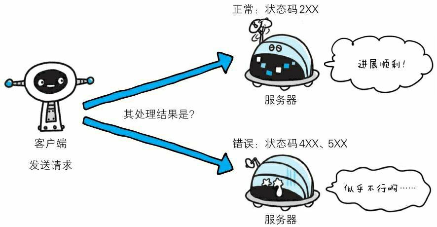
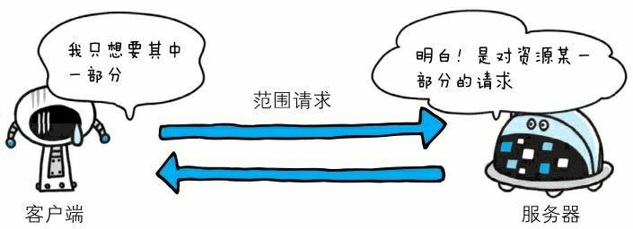
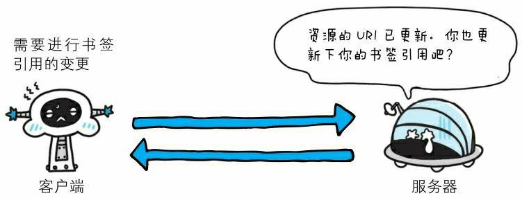
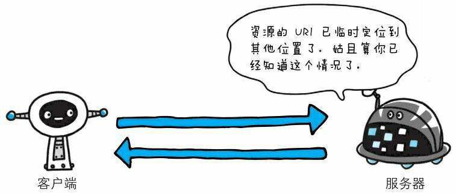
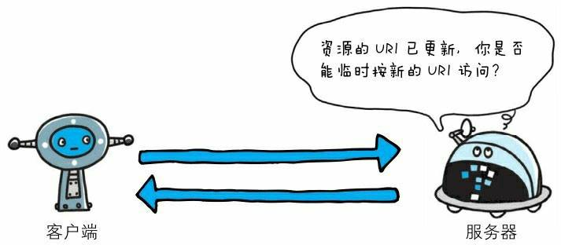
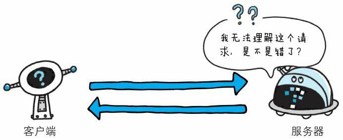
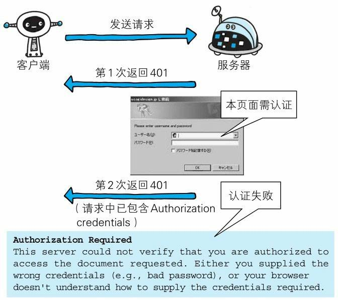
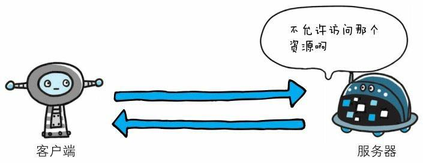
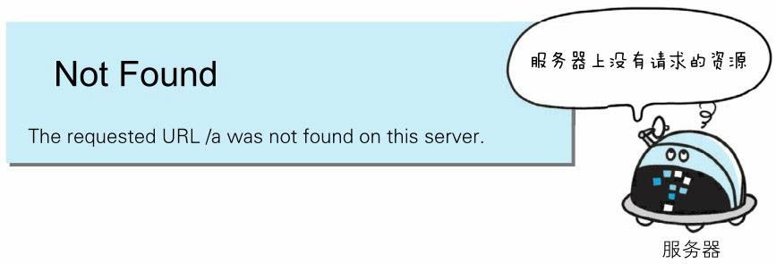
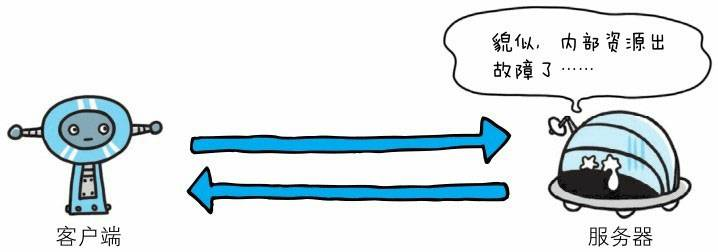

# HTTP 作用

- 表示客户端 HTTP 请求的返回结果
- 标记服务器端处理是否正常
- 通知出现的错误
  

## 组成

以 **3 位数字**和**原因短语**组成

```
200 OK
```

数字中的第一位指定了响应类别，响应类别分为以下 5 种：

- 1XX
- 2XX
- 3XX
- 4XX
- 5XX

| 状态码 | 类别                           | 原因短语                   |
| ------ | :----------------------------- | :------------------------- |
| 1XX    | Informational(信息性状态码)    | 接收的请求正在处理         |
| 2XX    | Success(成功状态码)            | 请求正常处理完毕           |
| 3XX    | Redirection(重定向状态码)      | 需要进行附加操作已完成请求 |
| 4XX    | Client Error(客户端错误状态码) | 服务器无法处理请求         |
| 5XX    | Server Error(服务端错误状态码) | 服务器处理请求错误         |

下面介绍常用的 14 种状态码

### 2XX

#### 200 OK (成功)


**表示客户端发来的请求在服务器端被正常处理了**
在响应报文中，随状态码返回的信息会因为请求方法的不同，而发生改变
GET 方法，返回首部和请求资源的实体
HEAD 方法，只返回首部，不返回实体的主体部分

**HTTP 报文：**

```
-----------------
报文首部
-----------------
空行（CR+LF）
-----------------
报文主体
-----------------
```

**报文主体与实体主体的区别：**

通常情况下，报文主体等于实体主体
只有在传输中进行编码操作时，实体主体的内容会发生变化，才导致实体主体和报文主体产生差异
传输中不进行编码，报文主体 = 实体主体
传输中若进行编码，报文主体 ≠ 实体主体

#### 204 No Content （没有实体主体）


表示**服务器接受的请求已处理成功，但在返回的响应报文中不含实体主体部分**（也不允许返回任何实体的主体）
即，客户端发送的请求，服务端正常处理了，但是没有返回主体给客户端，所以，浏览器显示的页面不会发生变化

#### 206 Partial Content



**表示客户端进行了范围请求，而服务器成功执行了这部分的 GET 请求**
响应报文中包含**Content-Range 制定范围的实体内容**

### 3XX 重定向

#### 301 Moved Permanently （永久性重定向）



表示请求的资源已被分配了新的 URI，以后应该是用该资源新的 URI
如：如果请求资源路径的最后忘记加斜杠 “/”,就会产生 301 状态码

#### 302 Found （临时性重定向）



表示请求的资源已被分配了新的 URI，希望用户（本次）能使用新的 URI 访问

**301 与 302 的区别**
301 表示资源分配了新的 URI 是永久性的
302 表示这是临时的，也就是说，已移动的资源对应的 URI 将来还有可能发生改变
比如：用户将 URI 保存为书签，但不会返回 301 状态码提醒用户去更新书签，而是依旧保留的是原来的 URI（导致返回 302 状态码的 URI）

#### 303 See Other



表示请求对应的资源存在着另一个 URI，应使用 GET 定向获取请求的资源
**303 与 302 功能相似，区别在于 303 明确表示客户端应使用 GET 方法获取球资源**

**_注意_：**

当 301、302、303 响应状态码返回时，几乎所有浏览器都会把 POST 改成 GET，并删除请求报文主体，之后请求会自动再次发送，
虽然 301、302 标准是禁止将 POST 改为 GET，但是，实际使用中大家都没有准守

#### 304 Not Modified（虽然划在 3XX 类别中，但是与重定向无关）


表示客户端发送附带条件的请求时，服务器允许请求访问资源，但是因请求未满足条件的情况后，直接返回 304
304 Not Modified（服务端资源未改变，可直接使用客户端未过期的缓存），304 状态码返回时，不包含人挪活而响应的主体部分

#### 307 Temporary Redirect（临时重定向）

与 302 类似，但是 307 会准守标准，不会从 POST 变成 GET（具体每个浏览器反应会不一样）

### 4XX 客户端错误

#### 400 Bad Request


表示请求报文中存在语法错误（一般是请求参数不正确）

#### 401 Unauthorized



表示请求需要通过 HTTP 认证（BASIC 认证、DIGEST 认证）的认证信息

#### 403 Forbidden



表示对请求的资源被服务器拒绝了
如：未获得文件系统的访问授权、
从未授权的发送源 IP 地址访问

#### 404 Not Found



表示服务器上没有请求的资源

### 5XX 服务器错误

#### 500 Internet Server Error



表示服务器在执行请求时发生了错误，也可能是 Web 应用存在 bug 或某些临时故障

#### 503 Service Unavailable


表示服务器这暂时处于超负载或则会正在停机维修中，现在无法处理请求

#### 参考资料

[图解 HTTP](https://book.douban.com/subject/25863515/)
