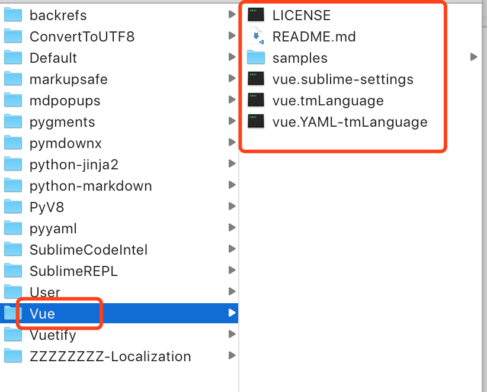
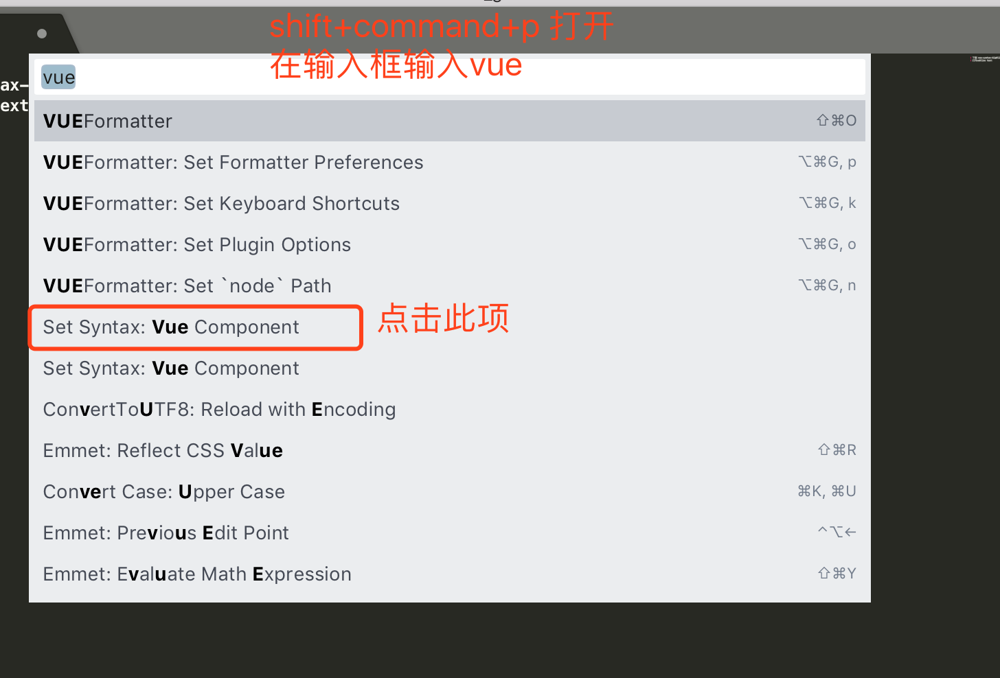

### 前言

系统：Mac
编辑器：Sublime Text3（3207）
安装插件：安装 vue 语法高亮插件 vue-syntax-highlight

最近一直在折腾 Sublime Text3 （3207），之前一直使用 VScode，但是不知怎么的，随着使用越久，编辑器越来越卡，网上搜索，大家都有这个困扰，好像是编辑器本身语言的问题，于是转向 sublime，但是 sublime 的上手就没有 VScode 那么顺了，......生命不止，折腾不熄！前端程序媛，想搭配一套自己喜欢的风格，于是随手记录下，以便自己和他人翻阅。

### 下载地址 vue-syntax-highlight:[vue-syntax-highlight](https://github.com/vuejs/vue-syntax-highlight)

去 github 上下载 vue-syntax-highlight

### 打开 sublime text

打开 Sublime Text => Perferences(首选项) => Browse Packages(浏览安装包)

### 在 Browse Packages 路径下新建 Vue 目录

### 解压 ue-syntax-highlight 至新建的 vue 文件夹

### 在 Sublime 中使用此插件

快捷键 Shift+Command+P

### 重启 sublime

其他插件安装以此类推......祝你代码无 bug (^\_^)
