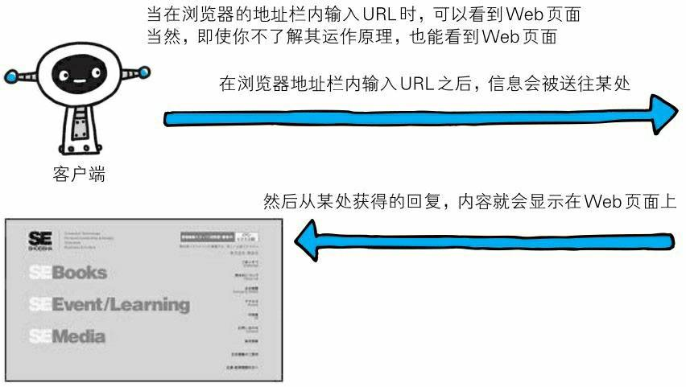
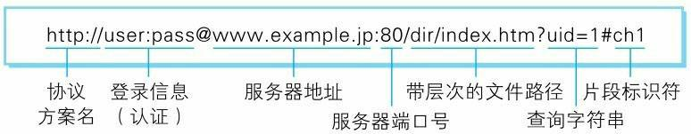
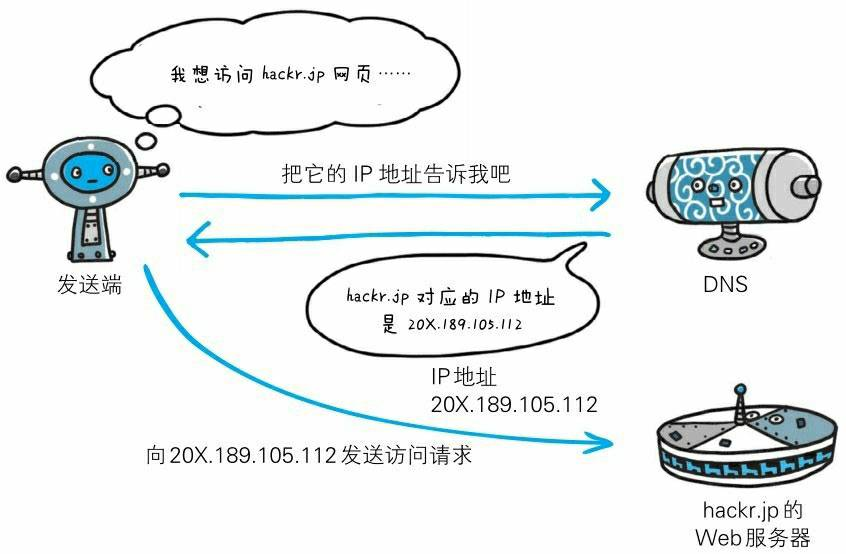
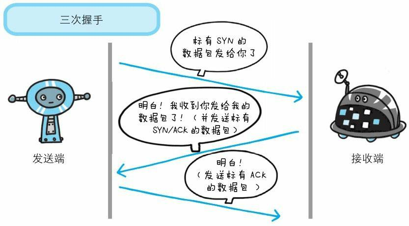
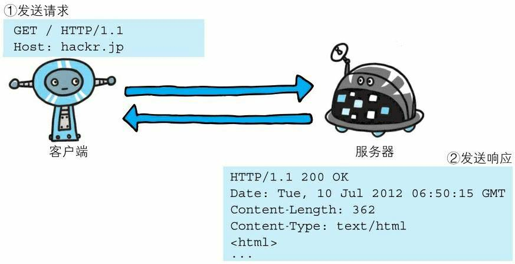
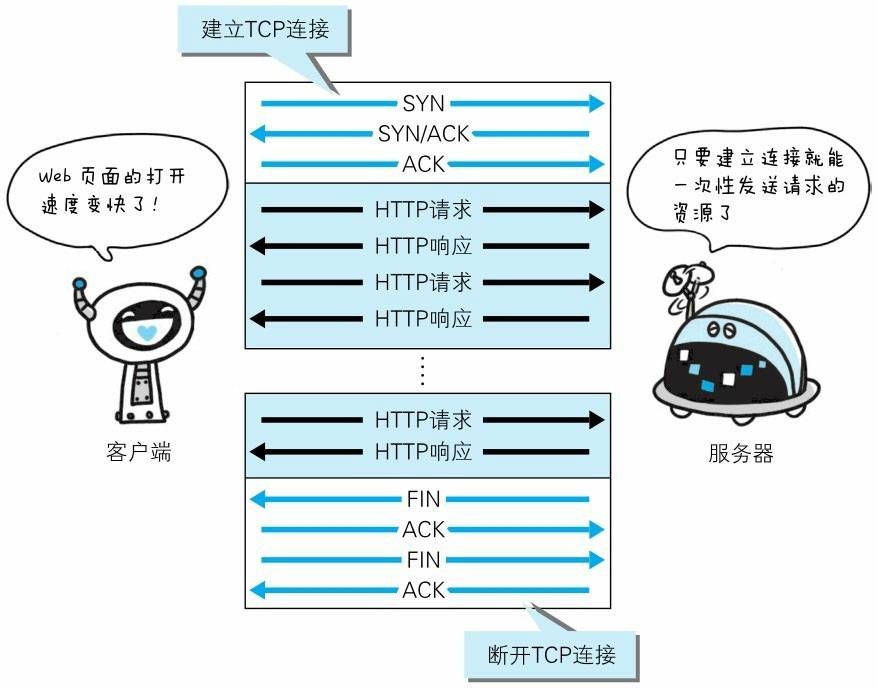
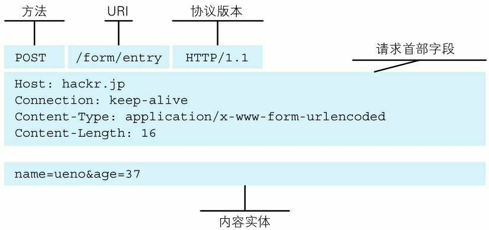
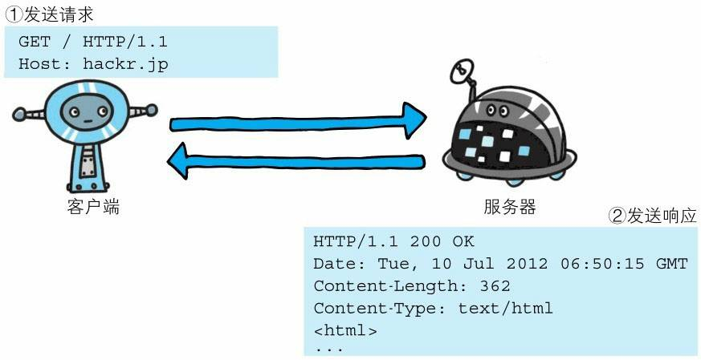
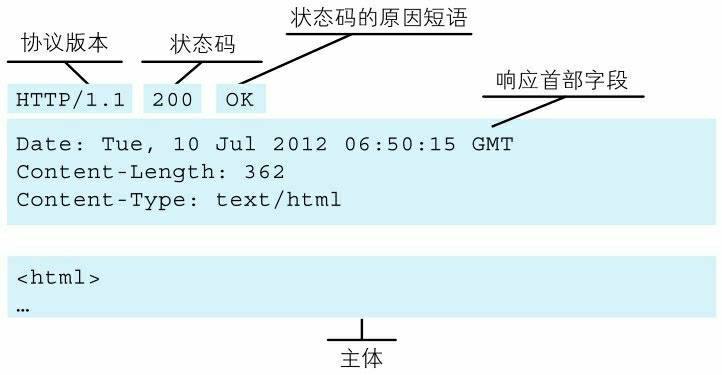

# 前言

## TCP/IP 协议族

HTTP(HyperText Transfer Protocol,超文本传输协议)
**TCP/IP 协议族**，按层次分：

- 应用层
  HTTP(HyperText Transfer Protocol,超文本传输协议)
  FTP(File Transfer Protocal,文件传输协议)
  DNS(Domain Name System,域名系统)

- 传输层
  TCP(Transmission Control Protocal,传输控制协议)
  UDP(User Data Protocal,用户数据报协议)

- 网络层
  IP(Internet Protocal,互联网协议)（IP 地址----ARP 协议----MAC 地址）

- 数据链路层
  控制操作系统
  硬件设备驱动
  NIC(Network Interface Card,网络适配器，即网卡)
  光纤

# 在地址栏输入 URL 到页面展示过程中，到底发生了什么？

## 过程如下：

- DNS 解析：将域名解析为 IP

- TCP 连接：TCP 三次握手

- 发送 HTTP 请求

- 服务器处理请求并返回 HTTP 报文

- 浏览器解析渲染页面

# DNS 解析

## URI（统一资源标识符）

## URL（统一资源定位符）

URL（Uniform Resource Locator），统一资源定位符，用于定位互联网上资源，俗称网址。 比如 http://www.w3school.com.cn/html/index.asp，遵守以下的语法规则：

**scheme://host.domain:port/path/filename** 各部分解释如下：

- scheme - 定义因特网服务的类型。常见的协议有 http、https、ftp、file，其中最常见的类型是 http，而 https 则是进行加密的网络传输。
- host - 定义域主机（http 的默认主机是 www）
- domain - 定义因特网域名，比如 w3school.com.cn
- port - 定义主机上的端口号（http 的默认端口号是 80）
- path - 定义服务器上的路径（如果省略，则文档必须位于网站的根目录中）。
- filename - 定义文档/资源的名称

## DNS（Domain Name System，域名系统）

域名系统（英文：DomainNameSystem，缩写：DNS）是互联网的一项服务。它作为将域名和 IP 地址相互映射的一个分布式数据库，能够使人更方便地访问互联网

- 第一步：客户机提出域名解析请求,并将该请求发送给本地的域名服务器.
- 第二步：当本地的域名服务器收到请求后,就先查询本地的缓存,如果有该纪录项,则本地的域名服务器就直接把查询的结果返回.
- 第三步：如果本地的缓存中没有该纪录,则本地域名服务器就直接把请求发给根域名服务器,然后根域名服务器再返回给本地域名服务器一个所查询域(根的子域)的主域名服务器的地址.
- 第四步：本地服务器再向上一步返回的域名服务器发送请求,然后接受请求的服务器查询自己的缓存,如果没有该纪录,则返回相关的下级的域名服务器的地址.
- 第五步：重复第四步,直到找到正确的纪录.
- 第六步：本地域名服务器把返回的结果保存到缓存,以备下一次使用,同时还将结果返回给客户机

## IP 地址 （Internet Protocol Address，网际协议地址）

IP 地址是指互联网协议地址，是 IP Address 的缩写。IP 地址是 IP 协议提供的一种统一的地址格式，它为互联网上的每一个网络和每一台主机分配一个逻辑地址，以此来屏蔽物理地址的差异。IP 地址是一个 32 位的二进制数，比如 127.0.0.1 为本机 IP。域名就相当于 IP 地址乔装打扮的伪装者，带着一副面具。它的作用就是便于记忆和沟通的一组服务器的地址。用户通常使用主机名或域名来访问对方的计算机，而不是直接通过 IP 地址访问。因为与 IP 地址的一组纯数字相比，用字母配合数字的表示形式来指定计算机名更符合人类的记忆习惯。但要让计算机去理解名称，相对而言就变得困难了。因为计算机更擅长处理一长串数字。为了解决上述的问题，DNS 服务应运而生。

## DNS 服务

DNS 服务是和 HTTP 协议一样的应用层的协议，他提供域名到 IP 地址见的解析服务。
计算机即可以被赋予 IP 地址，如：127.0.0.1，也可以被赋予主机名和域名。比如：www.hackr.jp
用户通常使用主机名和域名来访问对方的计算机，而不是通过 IP 地址访问。因为 IP 是由一组纯数字，不太符合人类的记忆习惯。
但是让计算机去理解主机名和域名就比较困难，因为计算机更擅长处理一长串数字。
为了解决上述问题，DNS 服务就应运而生了。DNS 协议提供通过域名查找 IP 地址，或者逆向通过 IP 地址反查找域名的服务。

## 浏览器如何通过域名去查询 URL 对应的 IP 呢

- 浏览器缓存：浏览器会按照一定的频率缓存 DNS 记录。
- 操作系统缓存：如果浏览器缓存中找不到需要的 DNS 记录，那就去操作系统中找。
- 路由缓存：路由器也有 DNS 缓存。
- ISP 的 DNS 服务器：ISP 是互联网服务提供商(Internet Service Provider)的简称，ISP 有专门的 DNS 服务器应对 DNS 查询请求。
- 根服务器：ISP 的 DNS 服务器还找不到的话，它就会向根服务器发出请求，进行递归查询（DNS 服务器先问根域名服务器.com 域名服务器的 IP 地址，然后再问.baidu 域名服务器，依次类推）

# TCP（Transmission Control Protocol，传输控制协议）

**三次握手**

- 第一次握手：建立连接时，客户端发送 syn 包（syn=j）到服务器，并进入 SYN_SENT 状态，等待服务器确认；SYN：同步序列编号（Synchronize Sequence Numbers）。
- 第二次握手：服务器收到 syn 包，必须确认客户的 SYN（ack=j+1），同时自己也发送一个 SYN 包（syn=k），即 SYN+ACK 包，此时服务器进入 SYN_RECV 状态；
- 第三次握手：客户端收到服务器的 SYN+ACK 包，向服务器发送确认包 ACK(ack=k+1），此包发送完毕，客户端和服务器进入 ESTABLISHED（TCP 连接成功）状态，完成三次握手。
  

# 发送 HTTP 请求

HTTP 请求分为三个部分：

- TCP 三次握手
  
- http 请求响应信息
- 关闭 TCP 连接。
  
  请求头
  

客户端发送 http 请求，服务端返回响应

# 服务器处理请求并返回 HTTP 报文

响应头

# 浏览器解析渲染页面

浏览器解析渲染页面分为一下五个步骤：

- 根据 HTML 解析出 DOM 树
- 根据 CSS 解析生成 CSS 规则树
- 结合 DOM 树和 CSS 规则树，生成渲染树
- 根据渲染树计算每一个节点的信息
- 根据计算好的信息绘制页面

## 1.根据 HTML 解析 DOM 树

- 根据 HTML 的内容，将标签按照结构解析成为 DOM 树，DOM 树解析的过程是一个深度优先遍历。即先构建当前节点的所有子节点，再构建下一个兄弟节点。
- 在读取 HTML 文档，构建 DOM 树的过程中，若遇到 script 标签，则 DOM 树的构建会暂停，直至脚本执行完毕。

## 2.根据 CSS 解析生成 CSS 规则树

- 解析 CSS 规则树时 js 执行将暂停，直至 CSS 规则树就绪。
- 浏览器在 CSS 规则树生成之前不会进行渲染。

## 3.结合 DOM 树和 CSS 规则树，生成渲染树

- DOM 树和 CSS 规则树全部准备好了以后，浏览器才会开始构建渲染树。
- 精简 CSS 并可以加快 CSS 规则树的构建，从而加快页面相应速度。

## 4.根据渲染树计算每一个节点的信息（布局）

- 布局：通过渲染树中渲染对象的信息，计算出每一个渲染对象的位置和尺寸
- 回流：在布局完成后，发现了某个部分发生了变化影响了布局，那就需要倒回去重新渲染。

## 5.根据计算好的信息绘制页面

- 绘制阶段，系统会遍历呈现树，并调用呈现器的“paint”方法，将呈现器的内容显示在屏幕上。
- 重绘：某个元素的背景颜色，文字颜色等，不影响元素周围或内部布局的属性，将只会引起浏览器的重绘。
- 回流：某个元素的尺寸发生了变化，则需重新计算渲染树，重新渲染。

<!-- # TCP四次挥手 -->

#### 参考资料

[图解 HTTP](https://book.douban.com/subject/25863515/)
