## 安装依赖环境

[Git:https://git-scm.com/downloads](https://git-scm.com/downloads)
[Node:https://nodejs.org/en/download/](https://nodejs.org/en/download/)

### 如果您的电脑中已经安装上述必备程序，那么恭喜您！接下来只需要使用 npm 即可完成 Hexo 的安装。

- 安装 Hexo

```
$ npm install -g hexo-cli

```

### 安装

- 安装 Git
  下载并安装 [Git](https://git-scm.com/downloads).
- 安装 Node
  下载并安装 [Node](https://nodejs.org/en/download/)
  - 检查是否安装成功

```
$ node -v
```

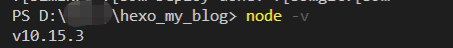

- 安装 Hexo

```
$ npm install -g hexo-cli

```

- 检查是否安装成功

```
$ hexo -v
```

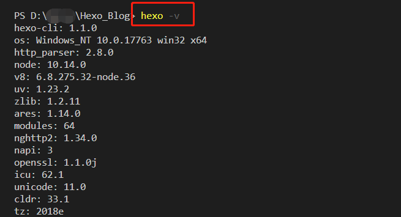

## 创建 Hexo

- 新建文件夹并初始化

```
$ hexo init <folder>
```

- 进入文件夹

```
$ cd <folder>
```

- 安装依赖

```
$ npm install

```

### 安装完成，项目结构目录如下

├── \_config.yml // 网站的配置信息
├── package.json // 应用程序信息
├── scaffolds // 模板文件夹
├── source // 存放用户资源
│ ├── \_drafts
│ ├── \_post
└── themes // 主题

- 创建

```
$ hexo g

```

- 在服务端打开

```
$ hexo server

```

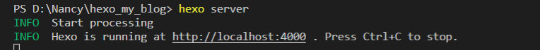
你就可以查看你的 hexo 了，默认端口 4000，[http://localhost:4000](http://localhost:4000)

## 新建 git 仓库项目

Github 账户注册和新建项目

- 新建
  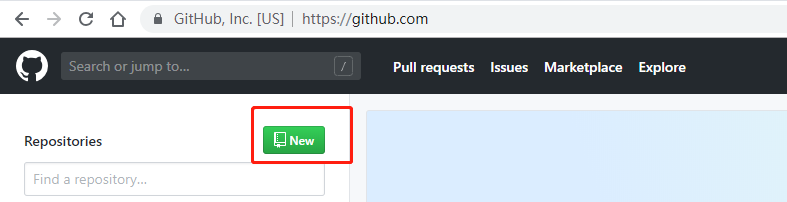
- 项目名称格式： **githubname**.github.io,如：zhangsan.github.io
  *注意：*一定要是你注册 github 的用户名+github.io
  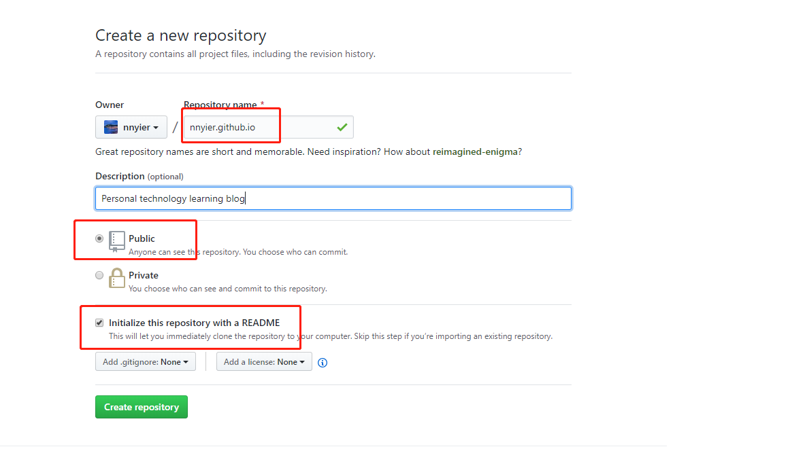
- Github Pages
  选择 settings，下拉至 Github Pages，你就发现你刚才新建的项目已经部署到网上了，可以直接访问
  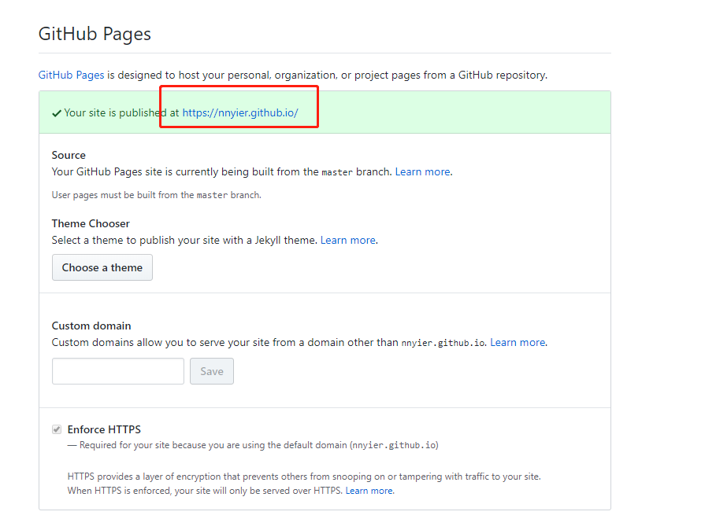

## 将 git 仓库与 hexo 关联起来

在所在文件夹 打开 Git Bash

- 设置你的 github 用户名和邮箱

```
$ git config --global user.name "github_name"
$ git config --global user.emil "github_emil"

//你的github注册名和注册邮箱

```

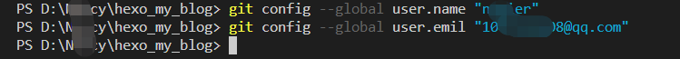

- 检查是否存在 ssh key

```
$ cd ~/.ssh
```

- 如果已经存在，可可以看见该.ssh 文件夹
  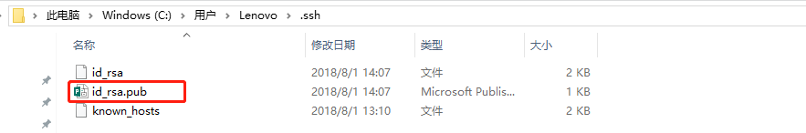
- 如果没有则需要去生成

```
$ ssh-keygen -t rsa -C "github_emil"
// 三次回车，就会生成key
```

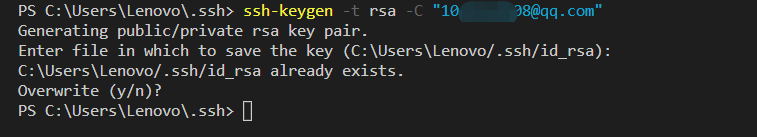

- 进入.ssh 文件夹,可以看见三个文件，id_rsa 是你的私钥，id_rsa.pub 是公钥，需要放在 github 上，这样你每次提交代码到仓库，都会进行本地的私钥和 git 混的公钥进行匹配，匹配完成，你才能进行一系列的操作
  
- 打开 id_rsa.pub，复制里面的内容到 github 上的 SSH key 中（最后一行包含的是你的注册邮箱的信息）
  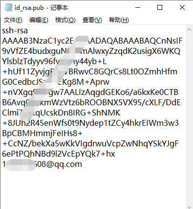
- 登录 Github，点击头像下的 **settings**
  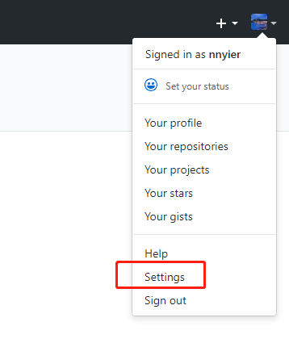
- 选择 **SSH and GPG keys**
- 找到右侧 **New SSH key**
  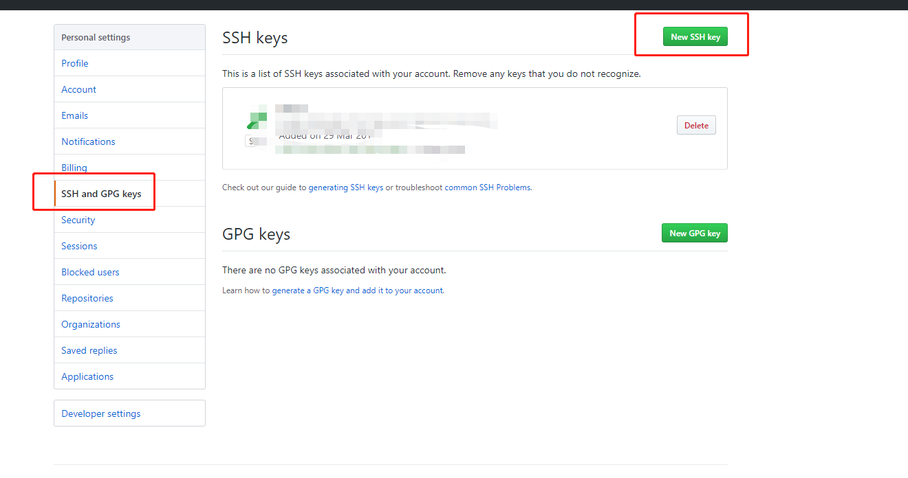
- title 随便填写，将复制的 id_rsa.pub 内容放至 key 中，点击**Add SSH key**保存，即可
- 输入 ssh -T git@github.com，测试添加 ssh 是否成功

```
$ ssh -T git@github.com
```

如果看见**Hi,xxxxx...**,说明你就成功了
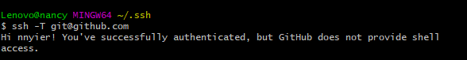

## 新建文章

```
$ hexo new post "如何利用Hexo-Github搭建博客"
```

## 配置 deploy

- 打开根目录下的\_config.yml 文件
- deploy:
  - type: git
  - repo: git@github.com:**githubname**/**githubname**.github.io.git
  - branch: master

## 安装插件

```
$ npm install hexo-deployer-git --save
```

## 生成文章

```
$ hexo g
```

## 完成部署

```
$ hexo d
```

## 打开 **https://githubname.github.io/** ,查看你的博客吧！

# 关于 Hexo 的详细配置

## 配置信息 \_config.yml

#### Site（网站）

| 参数        | 描述                               |
| ----------- | :--------------------------------- |
| title       | 网站标题                           |
| subtitle    | 网站副标题                         |
| description | 网站描述，description 主要用于 SEO |
| keywords    | 关键字                             |
| author      | 你的名字                           |
| language    | 网站使用的语言                     |
| timezone    | 网站时区，默认是你电脑的时区       |

#### URL(网址)

| 参数               | 描述                     | 默认值                    |
| ------------------ | :----------------------- | :------------------------ |
| url                | 网址                     |
| root               | 网站根目录               |
| permalink          | 文章的永久链接格式       | :year/:month/:day/:title/ |
| permalink_defaults | 永久链接中各部分的默认值 |

##### 网站存放在子目录

如果你的网站存放在子目录中：http://yoursite.com/blog，则：
url：http://yoursite.com/blog
root：/blog/

#### Directory(目录)

| 参数         | 描述                                         | 默认值         |
| ------------ | :------------------------------------------- | :------------- |
| source_dir   | 资源文件夹，这个文件夹用来存放内容           | source         |
| public_dir   | 公共文件夹，这个文件夹用于存放生成的站点文件 | public         |
| tag_dir      | 标签文件夹                                   | tags           |
| archive_dir  | 归档文件夹                                   | archives       |
| category_dir | 分类文件夹                                   | categories     |
| code_dir     | Include code 文件夹                          | downloads/code |
| i18n_dir     | 国际化文件夹                                 | :lang          |
| skip_render  | 跳过指定文件的渲染                           |

tips：如果您刚刚开始接触 Hexo，通常没有必要修改这一部分的值。

#### Writing（文章）

| 参数              | 描述                               | 默认值    |
| ----------------- | :--------------------------------- | :-------- |
| new_post_name     | 新建文章的名称                     | :title.md |
| default_layout    | 预设布局                           | post      |
| auto_spacing      | 在中文和英文之间加入空格           | false     |
| titlecase         | 把标题转为 title case              | false     |
| external_link     | 在新标签中打开链接                 | true      |
| filename_case     | 把文件名称转换为小写(1)或者大写(2) | 0         |
| render_drafts     | 显示草稿                           | false     |
| post_asset_folder | 启动 Asset 文件夹                  | true      |
| relative_link     | 把链接改为与根目录的相对位址       | false     |
| future            | 现实未来的文章                     | true      |
| highlight         | 代码块的设置                       |

#### Category & Tag（分类&标签）

| 参数             | 描述     | 默认值        |
| ---------------- | :------- | :------------ |
| default_category | 默认分类 | uncategorized |
| category_map     | 分类别名 |
| tag_map          | 标签别名 |

#### Date / Time format

Hexo 使用 Moment.js 来解析和显示时间。

| 参数        | 描述     | 默认值     |
| ----------- | :------- | :--------- |
| date_format | 日期格式 | YYYY-MM-DD |
| time_format | 时间格式 | HH:mm:ss   |

#### Pagination（分页）

| 参数           | 描述                                | 默认值 |
| -------------- | :---------------------------------- | :----- |
| per_page       | 每页显示的文章量 (0 = 关闭分页功能) | 10     |
| pagination_dir | 分页目录                            | page   |

#### Extensions（扩展）

[Plugins](https://hexo.io/plugins/)
[Themes](https://hexo.io/themes/)

| 参数  | 描述                            | 默认值    |
| ----- | :------------------------------ | :-------- |
| theme | 当前主题，值为 false 时禁用主题 | landscape |

#### Deployment

[Docs](https://hexo.io/docs/deployment.html)

├──deploy //配置
│ ├──type: git //类型
│ ├──repo: git@github.com:githubname/githubname.github.io.git //新建仓库地址,注意 githubname 是你的 github 名称
│ ├──branch: master //分支

## 常用命令

- **init** 新建一个网站

```
$ hexo init <folder>
```

如果没有设置文件夹，hexo 默认在当前文件夹新建

- **new** 新建一篇文章

```
$ hexo new [layout] <title>
```

如果没有设置 layout 的话，默认使用 \_config.yml 中的 default_layout 参数代替。默认是 post，如果标题包含空格的话，请使用引号括起来。

- 布局（Layout）
  hexo 三种默认布局：post、page、draft

  | 布局  | 路径            |
  | ----- | :-------------- |
  | post  | source/\_posts  |
  | page  | source          |
  | draft | source/\_drafts |

- 文件名称（title）
  Hexo 默认以标题做为文件名称，但您可编辑 new_post_name 参数来改变默认的文件名称，举例来说，设为 :year-:month-:day-:title.md 可让您更方便的通过日期来管理文章。

  | 变量     | 描述                               |
  | -------- | :--------------------------------- |
  | :title   | 标题（小写，空格将会被替换为短杠） |
  | :year    | 建立的年份，比如， 2015            |
  | :month   | 建立的月份（有前导零），比如， 04  |
  | :i_month | 建立的月份（无前导零），比如， 4   |
  | :day     | 建立的日期（有前导零），比如， 07  |
  | :i_day   | 建立的日期（无前导零），比如， 7   |

* **generate** 生成静态文件

```
$ hexo generate
```

也可以简写为：

```
$ hexo g
```

| 参数        | 描述                   |
| ----------- | :--------------------- |
| -d,--deploy | 文件生成后立即部署网站 |
| -w，--watch | 监视文件变动           |

```
$ hexo g -d
```

```
$ hexo g -w
```

- **publish** 发布草稿

通过 publish 命令将草稿移动到 source/\_posts 文件夹，该命令的使用方式与 new 十分类似，您也可在命令中指定 layout 来指定布局

```
$ hexo publish [layout] <filename>

```

- **server** 启动服务器

```
$ hexo server

```

| 参数        | 描述                           |
| ----------- | :----------------------------- |
| -p，--port  | 重设端口                       |
| -s,--static | 只使用静态文件                 |
| -l,--log    | 启动日志记录，使用覆盖记录格式 |

- **deploy** 部署网站

```
$ hexo deploy
```

也可以简写为：

```
$ hexo d
```

| 参数           | 描述                     |
| -------------- | :----------------------- |
| -g, --generate | 部署之前预先生成静态文件 |

```
$ hexo d -g
```

注意两者区别：

```
$ hexo g -d // 文件生成后立即部署网站(新生成的文件)
$ hexo d -g // 部署之前预先生成静态文件(之前已经生成的文件)
```

- **render** 渲染文件

```
$ hexo render <file1> [file2] ...
```

| 参数         | 描述         |
| ------------ | :----------- |
| -o, --output | 设置输出路径 |

- migrate 从其他博客系统

```
$ hexo migrate <type>

```

- **clean** 清除缓存文件

```
$ hexo clean

```

- **list** 列出网站资料。

```
$ hexo list <type>

```

- **version** 显示 Hexo 版本。

```
$ hexo version

```

- **安全模式**

```
$ hexo --safe
```

在安全模式下，不会载入插件和脚本。当您在安装新插件遭遇问题时，可以尝试以安全模式重新执行。

- **调试模式**

```
$ hexo --debug
```

在终端中显示调试信息并记录到 debug.log。当您碰到问题时，可以尝试用调试模式重新执行一次，并 提交调试信息到 GitHub。

- **简洁模式**

```
$ hexo --silent
```

隐藏终端信息。

- **自定义配置文件的路径**

```
$ hexo --config custom.yml
```

自定义配置文件的路径，执行后将不再使用 \_config.yml。

- **显示草稿**

```
$ hexo --draft
```

显示 source/\_drafts 文件夹中的草稿文章。

- **自定义 CWD**

```
$ hexo --cwd /path/to/cwd
```

自定义当前工作目录（Current working directory）的路径。

### Scaffold（模板）

在新建文章时，Hexo 会根据 scaffolds 文件夹内相对应的文件来建立文件，

```
$ hexo new photo "My Gallery"

```

在执行这行指令时，Hexo 会尝试在 scaffolds 文件夹中寻找 photo.md，并根据其内容建立文章，

新建文章模板

```
$ hexo new post "My Gallery"

```

新建分页模板

```
$ hexo new page "My Gallery"

```

新建草稿模板

```
$ hexo new draft "My Gallery"

```

以下是你可以在模版中使用的变量：

| 变量   | 描述         |
| ------ | :----------- |
| layout | 布局         |
| title  | 标题         |
| date   | 文件建立日期 |

## 创建项目
